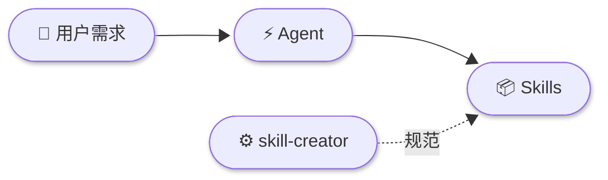
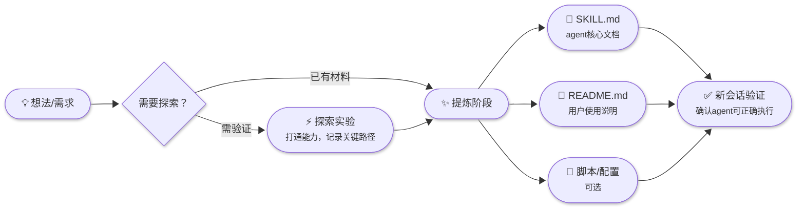

# AgentSkills

一套泛用、简洁、稳定、专业的 AI Agent 技能库。每个 skill 封装一种独立能力或流程，供 agent 按需调用。

## 如何使用 Skill

Skill 的本质就是一组 markdown 文档（和可选的脚本），放到你的工程里让 agent 阅读即可。

**最简单的用法：**

1. 把你需要的 skill 文件夹拷贝到工程目录下（文件夹里的 `SKILL.md` 是 agent 读取的核心文档）
2. 用自然语言告诉 agent 使用它：
```
请按照 skills/ssh-dev-suite 里的skill帮我连接远程服务器
```

就这么简单。Agent 会自动阅读 `SKILL.md` 并按其中的流程执行。

**更进阶：配置到 agent 的 skills 目录**

如果你把 skill 配置到 agent 的 skills 加载路径下（如 Claude Code 的 `.claude/skills/`），agent 会**自动根据当前场景匹配并调度**合适的 skill，无需你手动指定。



## Skill 列表

| Skill | 形态 | 说明 |
|-------|------|------|
| [ssh-dev-suite](skills/ssh-dev-suite/) | skills | SSH远程开发套件 |
| ┗ [connect](skills/ssh-dev-suite/connect/) | 子模块 | 连接、执行、传输、后台任务 |
| ┗ [deploy](skills/ssh-dev-suite/deploy/) | 子模块 | 部署与回滚 |
| ┗ [tunnel](skills/ssh-dev-suite/tunnel/) | 子模块 | 端口转发与代理 |
| ┗ [debug](skills/ssh-dev-suite/debug/) | 子模块 | 远程排查 |
| ┗ [long-task](skills/ssh-dev-suite/long-task/) | 子模块 | 长耗时任务管理 |
| [ascend-drivingsdk-skills](skills/ascend-drivingsdk-skills/) | skills | Ascend NPU DrivingSDK 开发辅助套件 |
| ┗ [npu-basics](skills/ascend-drivingsdk-skills/npu-basics/) | 子模块 | NPU 状态监控、版本查询、设备指定 |
| ┗ [cann-install](skills/ascend-drivingsdk-skills/cann-install/) | 子模块 | CANN 安装（社区版/商业版，三种方式） |
| ┗ [torch-npu-install](skills/ascend-drivingsdk-skills/torch-npu-install/) | 子模块 | PyTorch + torch_npu 安装 |
| ┗ [drivingsdk-install](skills/ascend-drivingsdk-skills/drivingsdk-install/) | 子模块 | DrivingSDK 编译安装与更新 |
| ┗ [container-deploy](skills/ascend-drivingsdk-skills/container-deploy/) | 子模块 | 容器环境一键部署（镜像/NPU/SSH/conda/部署档案） |
| ┗ [test-coverage](skills/ascend-drivingsdk-skills/test-coverage/) | 子模块 | C++/Python 代码覆盖率收集 |
| [doc-illustrator](skills/doc-illustrator/) | 单体 | 为技术文档生成Mermaid插图 |

## Skill Creator

[skill-creator](skill-creator/) 是本项目的 meta skill，定义所有 skill 的开发规范与模板。



- **两种类型**：能力型（封装操作，重心在脚本，SKILL.md ≤ 1KB）/ 流程型（指导方法论，重心在文档，SKILL.md ≤ 3KB）
- **两种形态**：单体 skill（平铺结构）/ skill suite / skills（子目录分模块 + 共享基础）
- **开发流程**：探索（打通能力）→ 提炼（标准化输出）→ 验证发布

详见 [skill-creator/README.md](skill-creator/README.md)。

## 快速开始

在 agent 对话中直接描述需求，agent 会自动匹配对应 skill 执行：

```
帮我配置SSH连接到我的开发服务器
```

开发新 skill：

```
我想开发一个skill：[描述你想要的能力]
```

## 目录结构

```
skill-creator/                          # Meta skill（开发规范与模板）

skills/
  ssh-dev-suite/                        # SSH远程开发套件（skills）
    connect/ deploy/ tunnel/            #   子模块
    debug/ long-task/
    _lib/                               #   共享工具脚本
  ascend-drivingsdk-skills/             # Ascend NPU DrivingSDK 套件（skills）
    npu-basics/                         #   NPU 基础命令
    cann-install/                       #   CANN 安装
    torch-npu-install/                  #   PyTorch + torch_npu 安装
    drivingsdk-install/                 #   DrivingSDK 编译安装
    test-coverage/                      #   覆盖率收集
    container-deploy/                   #   容器环境部署
    _lib/                               #   共享工具脚本
  doc-illustrator/                      # 文档插图生成

docs/plans/                             # 设计与计划文档
```
