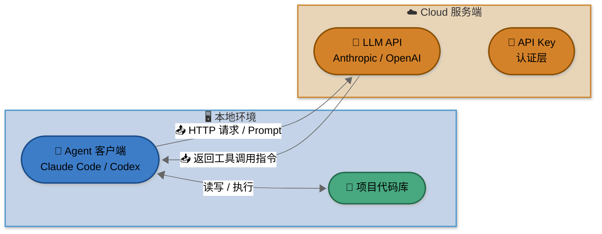
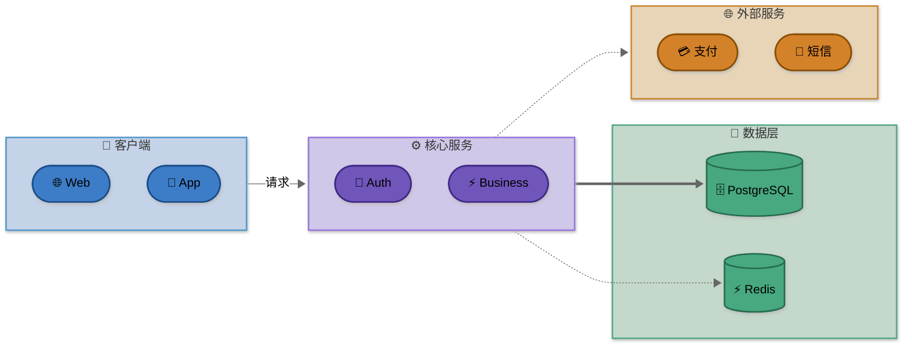

# markdown-mermaid-illustrator

为 Markdown 文档生成高质量 Mermaid 图表的 Skill，解决 Dark/Light 双主题兼容、排版对称、语义化配色等核心问题。

## 功能

- 分析文档内容，识别需要配图的位置
- 中饱和度节点色 + 中色调 subgraph 背景，Light / Dark 模式均不突兀
- 禁止硬编码文字颜色，由渲染引擎自动适配
- 混合模板匹配（常见类型）和 LLM 自主设计（特殊场景）两条路径
- 用户确认后自动替换到文档中

## 支持的图表类型

### ✅ Mermaid 原生支持

| 分类 | 图表类型 | 模板 |
|------|---------|------|
| 发散/结构 | 思维导图、树状/组织图、亲和分组图 | mindmap / tree / affinity |
| 流程/过程 | 流程图、泳道图、状态图、用户旅程图 | flow / swimlane / state / journey |
| 关系/网络 | 架构图、时序图、ER 图、类图、概念图 | architecture / sequence / er / class / concept |
| 时间/计划 | 甘特图、时间线 | gantt / timeline |
| 分析/决策 | 四象限/优先级矩阵、决策树、鱼骨图（近似） | quadrant / decision / fishbone |
| 数据/对比 | 饼图、折线/柱状图（beta）、桑基图（beta） | pie / xychart / sankey |

### ⚠️ 超出 Mermaid 能力（告知用户并推荐替代工具）

| 图表类型 | 推荐工具 |
|---------|---------|
| 雷达图、散点图、热力图、气泡图 | ECharts、Plotly、Vega-Lite |
| 大规模网络图、知识图谱 | Gephi、Cytoscape |
| 标准 BPMN | draw.io、Camunda |
| 路线图（跨期可视化） | Miro、Roadmunk |

## 使用方式

```
请用 markdown-mermaid-illustrator 改进 README.md 中的插图
请用 markdown-mermaid-illustrator 为 docs/architecture.md 添加架构图
请用 markdown-mermaid-illustrator 重构这个图表以修复 Dark 模式兼容问题
```

## 设计原则

**节点配色**：中饱和度填充色（非浅色系），引擎自动推断文字颜色，不硬编码 `color:`。

**subgraph 背景**：中色调实色（L ≈ 70-80%），通过 `style SubgraphID fill:...,stroke:...` 单独设置，不同区域可独立配色。Mermaid 不支持 `rgba()` 或 8位 hex alpha。

**布局**：默认 `flowchart LR`（水平），`subgraph` 内部 `direction TB` 分层叠加。

**对称性**：用 `~~~` 对齐同层节点，平衡各 subgraph 内节点数量。

## 示例：Agent-LLM 架构图

> 来源：AgenticCodingTutorial ch01，原图使用硬编码 `color:#fff`，Dark 模式不兼容。以下为重绘版本。



## 示例：四区域分层架构图



## 注意事项

- Mermaid 在 GitHub、GitLab、Obsidian、MkDocs 等平台原生渲染
- Mermaid **不支持** `rgba()` 或 8位 hex alpha，subgraph 背景必须用标准 6位 hex
- 时序图参与者数量控制在 ≤ 7 个避免过宽
